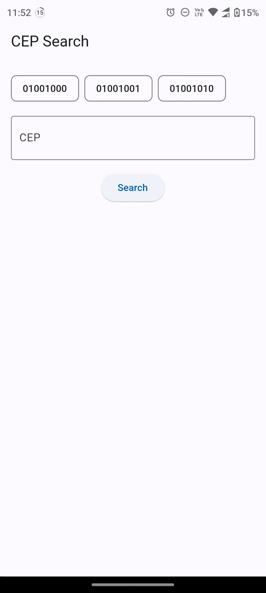

# bloc

**ES**:
Este proyecto es parte de la prueba tecnica como desarrollador Flutter en Accentio Studios
Esta prueba tecnica fue desarrollada con Flutter 3.13. y Dart 3.1.0

**PT**:
Este projeto faz parte do teste técnico como desenvolvedor Flutter na Accentio Studios
Este teste técnico foi desenvolvido com Flutter 3.13. e Dart 3.1.0



## Requisitos
**ES**:
En este proyecto te vas a encontrar con una aplicacion basica para busqueda de CEP en Brasil. La aplicacion funciona actualmente,
pero no esta usando BLoCs.
Tu tarea es refactorizar la aplicacion para usar BLoC. La aplicacion debe seguir funcionando como esta actualmente, pero usando BLoC.

Debes hacer 2 alternativas, una usando la libreria ```flutter_bloc``` y otra sin usarla, la aplicacion debe funcionar perfectamente
intercambiando entre una y otra.

**PT**:
Neste projeto você encontrará um aplicativo básico para busca de CEP no Brasil. O aplicativo está funcionando atualmente.
mas não está usando BLoCs.

Sua tarefa é refatorar o aplicativo para usar BLoC. O app deve continuar funcionando como está atualmente, mas usando BLoC.

Você deve fazer 2 alternativas, uma utilizando a biblioteca ```flutter_bloc``` e outra sem utilizá-la, a aplicação deve funcionar perfeitamente
trocando entre um e outro.

**ES**:
### To-do:
- [ ] Utiliza el archivo ```home_page_bloc.dart``` para crear tu view que va a consumir tu BLoC.
- [ ] Utiliza el archivo ```search_cep_bloc.dart``` como base para crear tu BLoC (SIN USAR LA LIBRERIA ```flutter_bloc```).
- [ ] Crea todos los estados y eventos necesarios para que la aplicacion funcione correctamente.
- [ ] Testea la aplicacion usando el BLoC.
- [ ] Ahora crea una segunda alternativa usando la libreria flutter_bloc para crear tu BLoC en el archivo ```search_cep_flutter_bloc```.dart.
- [ ] Testea la aplicacion con el BLoC que usa ```flutter_bloc```.

### Extra
- [ ] Mejorar la legibilidad del codigo.

**PT**:
### To-do:
- [ ] Utilize o arquivo ```home_page_bloc.dart``` para criar sua view que consumirá seu BLoC.
- [ ] Utilize o arquivo ```search_cep_bloc.dart``` como base para criar seu BLoC (SEM USAR A BIBLIOTECA ```flutter_bloc```).
- [ ] Cria todos os estados e eventos necessários para que a aplicação funcione corretamente.
- [ ] Teste a aplicação usando BLoC.
- [ ] Agora crie uma segunda alternativa utilizando a biblioteca flutter_bloc para criar seu BLoC no arquivo ```search_cep_flutter_bloc.dart```.
- [ ] Teste a aplicação com o BLoC que utiliza ```flutter_bloc```.

### Extra
- [ ] Melhore a legibilidade do código.

## Como entregar la prueba / Como entregar o teste
**ES**:
Debes hacer un fork de este repositorio y crear un nuevo branch con tu nombre y apellido. Despues de hacer los cambios para solucionar la prueba debes hacer un pull request a este repositorio con los cambios realizados. Debes usar Conventional Commits para los mensajes de los commits.

**PT**:
Você deve fazer um fork este repositório e criar um novo branch com seu nome e sobrenome. Após realizar as alterações para resolver o teste você deve fazer um pull request para este repositório com as alterações realizadas. Você deve usar Conventional Commits para mensagens de commit.
